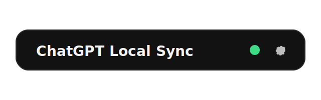

# ChatGPT Local Sync

A Chrome MV3 extension that keeps your ChatGPT conversations synced to a local folder using the File System Access API. No native host or companion app required.



## Features

- Syncs conversations from ChatGPT to a local folder.
- Writes per-conversation JSON and Markdown files.
- Maintains a local `index.json` with metadata for all chats.
- Incremental sync using `order=updated`, with full inventory refreshes when needed.
- Optional deletion of local files when chats disappear from ChatGPT.
- In-page sync widget plus a detailed options page with a local index viewer.

## Requirements

- Google Chrome with the File System Access API available.
- You must be signed in at `https://chatgpt.com/`.
- At least one ChatGPT tab must be open for syncs to run.

## Install (Chrome)

1. Open `chrome://extensions`.
2. Enable Developer mode.
3. Click Load unpacked and select this folder.
4. Open `https://chatgpt.com/`.
5. Open the in-page widget (it is collapsed by default), click Sync now, and choose your local folder the first time.

## Usage

- The in-page widget appears in the left sidebar below the account section and is collapsed by default.
- Click the title bar to expand/collapse. The dot shows sync state (spinner while syncing, green when synced).
- Click Sync now to run a manual sync (folder selection/permission is prompted if needed).
- Click the gear icon to open the options page.
- Configure sync interval, file formats, and parallel fetches in Options.

## Local file layout

```
Your-Folder/
  index.json
  conversations/
    <conversation-id>.json
    <conversation-id>.md
```

## Data formats

- JSON includes `meta`, `messages`, and `raw` conversation payloads.
- Markdown includes YAML front matter and a rendered chat transcript.

## Options page

- Shows sync status and last sync summary.
- Shows a scrollable local index with per-conversation status.
- Filters by title/id, status, and sort order.
- Includes a Re-inventory button to force a full listing from the beginning.

## Troubleshooting

- "No ChatGPT tab open": open a ChatGPT tab and retry.
- "Select a folder": click Sync now to choose a folder.
- "Folder access required": re-grant access by clicking Sync now.
- If a sync is interrupted, it resumes from the last recorded inventory cursor.

## Notes

- This uses undocumented ChatGPT web endpoints and may break if the site changes.
- The File System Access API requires a user gesture to grant access.
- Clearing ChatGPT site data removes the stored folder handle.
- All synced files (including JSON `raw` payloads) are stored unencrypted on disk. Choose a private folder and avoid shared/cloud locations if that is a concern.

## Development

- Main files: `manifest.json`, `background.js`, `content.js`, `options.html`, `options.js`.
- Reload the extension after code changes in `chrome://extensions`.

For detailed behavior and data flow, see `SPECIFICATIONS.md`.
